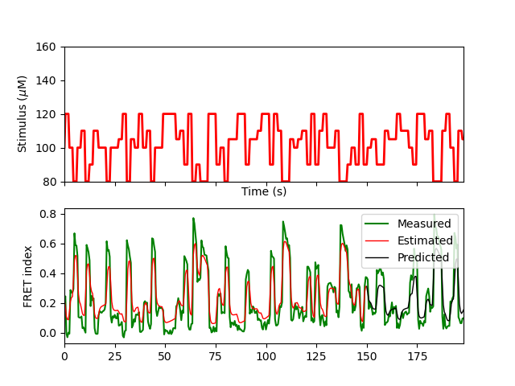

# FRET-data-assimilation




This repository estimates parameters and hidden states of dynamical models from single-cell FRET data using *variational annealing* (Ye et al, *Phys. Rev. E* **92**, 052901, 2015), a technique of nonlinear data assimilation for pinpointing global minima among highly non-convex cost functions.
This code adopts Paul Rozdeba's VarAnneal package, rewritten using the automatic differentiation package ```autograd```.

## Getting Started
### Dependencies
FRET-data-assimilation requires the following software:
1. Python 3 (tested on version 3.8.11)
2. SciPy (tested on version 1.7.1)
3. NumPy (tested on version 1.20.3 )

## Usage
### Define the local data directory

Before doing any estimations, you must define the data directory. The directory in which both input and output data will be stored is defined in ```src/local_methods.py```. The existing repository has a ```src/local_methods_sample.py```, which you should copy to ```src/local_methods.py``` (this file is in *gitignore*). Within the ```def_data_dir()``` function, define ```data_dir```  as the absolute path to where your i/o data will be stored. 

### Each estimation (not dataset) is defined by a unique specs file

To perform any kind of data processing/assimilation using this code, you must create an associated specifications .txt file. This file stores information about the stimulus and measurement protocols and parameters, as well as the inference model parameters.
Currently, this code can be used for two primary purposes:
1. Parameter estimation of existing data
2. Stimulus selection for future parameter estimation


### Data directory structure

The data directory must contain at least the following subdirectories:
1. ```/specs```, which will be populated by a specifications .txt file for each assimilation protocol that must be performed.
2. ```/recordings```, which must contain subfolders with recorded FRET data stored in .mat structures.

As the code runs, the following directories will also be created:
1. ```/meas_data```, which contains NumPy versions of the recorded data above.
2. ```/stim```, which contains stimulus protocols for the recordings above.
3. ```/objects```, which contains the results of the variational annealing for each trial
4. ```/ests```, which contains estimations based on the inferred parameters
Note that if st.imuli and/or recordings need to be computationally generated (rather than experimentally measured), then the corresponding stimulus and recording files will be automatically populated by the code.

### Inferring Parameters from Experimental Data

The ```/scripts``` folder contains two demo scripts that implement this code. ```VA_example.py``` demonstrates how
one can start from a .mat file with the stimulus and measurements, and proceed to infer relevant cellular parameters.
```simulation_example.py``` simulates a cell with given parameters, and then reinfers them based on the data generated.

### Selecting Optimal Stimuli

On some occasions, you may wish to test the feasibility of parameter inference and/or choose an optimal stimulus, by generating fake data from a known parameter set,
and using variational annealing to re-infer these parameters for comparison. With this goal in mind, the stimulus file may be manually created and saved in the ```/stim``` directory, or may be generated by a specified algorithm.
An example with stimulus generation is shown in ```stim_selection_example.py```.

### Creating a specs.txt file

To run the variational annealing algorithm to infer parameters given the data, a specs file must first be created in the ```/specs``` subdirectory. The specs file contains all the information about which recorded dataset to use and the parameters of the assimilation. It may also contain parameters of generated fake data, if not using recorded data. Since a specs file is unique to an assimilation, and NOT a data set, distinct estimations utilizing the same data set (say, using different model equations or parameter bounds) would each have a distinct specs file.
This specs file is stored as a JSON object, and can be created and edited very easily from a specifications dictionary in Python, as shown in the demo scripts.

### Specifications defined in the specs file

Each specification defined is one of three types:

#### ```est_spec``` : The type of estimation

Currently, there is only one ```est_spec```, which is the type of estimation, ```est_type```, and this has only one possible value, ```VA``` -- estimation by variational annealing. This will soon accept other methods such as linear kernel estimation, etc.

#### ```data_var``` / ```est_var```: Specifications of the estimation procedure

Currently, there is no functional distinction between ```est_var``` and ```data_var```. The first is meant for specifications of the actual estimation, whereas the second is meant for specifications on the nature of the input data and the model. At this point, one may simply use ```data_var``` for any of these variables, though it may be handy to keep them distinct for bookkeeping. 

There are several variables that are of this type:

| variable   | variable definition                      | values                                   |
| :--------- | ---------------------------------------- | ---------------------------------------- |
| nD         | dimension of model system                | int; typically 2 for FRET data (FRET/activity and methylation). must match dimension of model system defined in src/models (see below) |
| nT         | number of timepoints for full FRET trace (both for estimation and predictive cross validation) | int; must equal the number of rows in .meas and .stim |
| nP         | number of parameters in model     | int; must equal the dimension of the parameters in the model system defined in src/models (see below) |
| dt         | timestep of data                         | float; must equal the timestep in the first column of both .meas and .stim.|
| stim_file  | stimulus filename                        | str; name (without .stim extension) of stimulus file. If not provided and a stim_type is also not provided, then the name of the specs file is used instead |
| meas_file  | measurement filename                     | str; name (without .meas extension) of measurement file. If not provided and gen_meas is False, then the name of the specs file is used instead |
| meas_noise | covariance of measurement data           | list; assumed covariance of each measured variable. For now, covariance cannot vary with time.  |
| L_idxs     | measured indices                         | list; indices of measured variables, corresponding to indices of state variables defined in src/models (see below) |
| bounds_set | parameter bounds dictionary within model class to use | str; corresponds to one of the keys in the src/models.my_model.bounds dictionary, where my_model is the model class  (see below) |
| model      | the presumed model equations             | str; must be a class in src/models, following the layout as described in src/models.generic_model_class (see below). |
| est_beg_T  | initial estimation time                  | float; time at which to begin using estimated data; must be less than nT*dt |
| est_end_T  | final estimation time                    | float; time at which estimated data ends; must be less than nT*dt but greater than est_beg_T |
| pred_end_T | final prediction                         | float; ending time of prediction window for cross-validation and error estimation; prediction window begins at est_end_T, when the estimation ends. Should be less than nT*dt but greater than est_end_T |

Importantly, as noted above, one can omit the ```meas_file``` and ```stim_file``` variables if the specs file has the same name as the stimuli and measurement files. 

To see how the specs file is generated, and how it looks like as a .txt file, run a demo script.

### Defining model classes 

The model class contains all the information on the dynamical model to which the data is assimilated.
Importantly, the model class contains specifications on the number of parameters (nP) and the number of dynamical states in the model (nD),
along with a  ```bounds``` attribute, a dictionary whose keys are each themselves dictionaries holding the upper and lower bounds for states and parameter estimation, respectively. The method ```df``` defines the ODEs containing the model dynamics. 

You can use the models already existing in ```/src/models.py```, or define your own.

### Running variational annealing in parallel
Running VA (using the ```est_VA``` function in ```src.est_VA.py```) requires a seed for random number generators. The seed is used to generate a random initial estimate for the state variables **x** at all points throughout the estimation window, as well as for all the parameters to be estimated. The initial estimate is chosen uniformly within the bounds of the states or parameters.  This seed is important since due to the nonlinearity of the model dynamics, the cost function is not convex; different initializations may return different minima. Typically, one runs many estimates in parallel on a computing cluster. Later, these will be aggregated to find the optimal estimate.

### Working with fake (simulated) data

Sometimes you want to test the assimilation with fake noisy data. This can be done by integrating the presumed model equations, and then adding fake measurement noise. The added specifications for manual data generation to be listed in the specs file are:

| variable          | variable definition                      | values                                   |
| ----------------- | ---------------------------------------- | ---------------------------------------- |
| stim_type         | type of stimulus; at this point only step stimuli are accepted | str; ```step``` is only accepted value at this time |
| step_stim_density | for step stimuli, the number of switches in the signal | int; should be less than nT              |
| step_stim_seed    | for step stimuli, seed for random number generator for the stimuli values | int                                      |
| step_stim_vals    | values for step stimuli                  | list; the distinct possible values of dynamic step stimuli. Ensure that there are no spaces between values in the specs file |
| meas_noise        | standard deviations of the noise for each measured variable. To be added to "ground truth" data to generate the "noisy" observations | list; should be same length as L_idxs. Ensure that there are no spaces between values in the specs file. |
| params_set        | the parameter set in the model definition to use to generate data | str; corresponds to one of the keys in the src/models.my_model.params dictionary, where my_model is the model class |
| x0                | The initial state of the system for forward integration to generate data | list; should be same llength as nD       |

One may generate fake data, see demo. The stimuli and measurements will, as before, be saved in the appropriate folders in data directory.

## Contributing

Please read [CONTRIBUTING.md](https://gist.github.com/PurpleBooth/b24679402957c63ec426) for details on our code of conduct, and the process for submitting pull requests to us.

## Authors

[**Nirag Kadakia**](http://nirag.ucsd.edu/) and Agastya Rana.

## License

This project is licensed under the MIT License - see the [LICENSE.md](LICENSE.md) file for details
