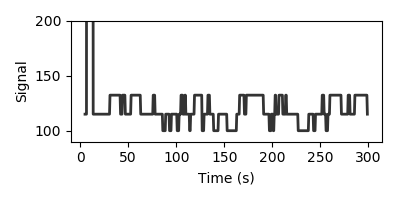

# FRET-data-assimilation

 

This repository estimates parameters and hidden states of dynamical models from single-cell FRET data using *variational annealing* (Ye et al, *Phys. Rev. E* **92**, 052901, 2015), a technique of nonlinear data assimilation for pinpointing global minima among highly non-convex cost functions.
This code utilizes an updated version of Paul Rozdeba's VarAnneal package that is written in Python 3, and utilizes an up-to-date automatic differentiation package (```autograd```).

## Getting Started
### Dependencies
FRET-data-assimilation requires the following software:
1. Python 3 (tested on version 3.8.11)
2. SciPy (tested on version 1.7.1)
3. NumPy (tested on version 1.20.3 )
4. [VarAnneal](https://github.com/agastya-rana/varanneal), a Python implementation of variational annealing that utilizes automatic differentiation.
   To install, follow the instructions in the VarAnneal repository readme.

## Usage
### Define the local data directory

Before doing any estimations, you must define the data directory. The directory in which both input and output data will be stored is defined in ```src/local_methods.py```. The existing repository has a ```src/local_methods_sample.py```, which you should copy to ```src/local_methods.py``` (this file is in *gitignore*). Within the ```def_data_dir()``` function, define ```data_dir```  as the absolute path to where your i/o data will be stored. 

### Each estimation (not dataset) is defined by a unique specs file

To perform any kind of data processing/assimilation using this code, you must create an associated specifications .txt file. This file stores information about the stimulus and measurement protocols and parameters, as well as the inference model parameters.
Currently, this code can be used for two primary purposes:
1. Parameter estimation of existing data
2. Stimulus selection for future parameter estimation


### Data directory structure

The data directory contains the following subdirectories:
1. ```/specs```, which contains a specifications .txt file for each assimilation protocol that must be performed.
2. ```/recordings```, which contains subfolders containing recorded FRET data stored in .mat structures.
3. ```/meas_data```, which contains NumPy versions of the recorded data above.
4. ```/stim```, which contains stimulus protocols for the recordings above.

Note that if stimuli and/or recordings need to be computationally generated (rather than experimentally measured), then the corresponding stimulus and recording files will be automatically populated by the code.

### Processing experimental data for assimilation

Given a .mat file containing both the stimulus protocol and experimental FRET data such as ```/recordings/FRET_data/example.mat```, the corresponding NumPy stimulus and measurement files can be generated and stored in the ```/stim``` and ```/meas_data``` directories respectively as follows.
Working from the ```./scripts``` folder, we generate a stimulus and measurement file for cell 7 out of the 30 cells in ```/recordings/FRET_data/example.mat``` via:
```python
from gen_py_data_from_mat import gen_py_data_from_mat
gen_py_data_from_mat(dir='FRET_data', mat_file='example.mat', cell=7)
```
This will generate the following files, with data in 2 tab-delimited columns; the first consists of the time points, the second are the values.
 
```
/meas_data/FRET_data_cell_7.meas
/stim/FRET_data_cell_7.stim
```

Sometimes you may have many stimuli and measurement files you want to get a quick visualization of (e.g. to see if the data is garbage or usable). To generate quick plots for all .stim and .meas files that exist, run from ```./scripts```:

```{python} quick_plots_stim_and_meas
$ python quick_plots_stim_and_meas
```

This will generate .png plots for stimuli and measurements in the respective folders.

### Processing simulated data for assimilation

On some occasions, you may wish to test the feasibility of parameter inference and/or choose an optimal stimulus, by generating fake data from a known parameter set,
and using variational annealing to re-infer these parameters for comparison. With this goal in mind, the stimulus file may be manually created and saved in the ```/stim``` directory, or may be generated by a specified algorithm.
In the latter case, the stimulus generation (and in both cases, the corresponding measurement generation) will be carried out by the code before the inference step, so nothing has to be done at this stage.


### Creating a specs.txt file

To run the variational annealing algorithm to infer parameters given the data, a specs file must first be created in the ```/specs``` subdirectory. The specs file contains all the information about which recorded dataset to use and the parameters of the assimilation. It may also contain parameters of generated fake data, if not using recorded data. Since a specs file is unique to an assimilation, and NOT a data set, distinct estimations utilizing the same data set (say, using different model equations or parameter bounds) would each have a distinct specs file.


### Each estimation -- not data set -- is defined by a unique specs file 


The specs file contains all the information about which recorded dataset to use *and* the parameters of the assimilation. It may also contain parameters of generated fake data, if not using recorded data. Since a specs file is unique to an assimilation, and NOT a data set, distinct estimations utilizing the same data set (say, using different model equations or parameter bounds) would each have a distinct specs file. This specs file must be manually created and stored in the ```/specs``` directory for each desired assimilation.

A typical specs file looks like:
```
# DATA                  VARIABLE NAME           VALUE
data_var                nD                      2
data_var                nT                      767
data_var                dt                      0.5
data_var                nP                      10
data_var                stim_file               170913_Device1_FRET1_cell_7
data_var                meas_file               170913_Device1_FRET1_cell_7
data_var                meas_noise              [1.0]
data_var                L_idxs                  [1]

# ESTIMATION VARS       VARIABLE NAME           VALUE
est_var                 model                   MWC_MM
est_var                 bounds_set              default
est_var                 est_beg_T               5
est_var                 est_end_T               150
est_var                 pred_end_T              300
    

# ESTIMATION SPECS      ESTIMATION SPECS        VALUE
est_spec                est_type                VA
```

Hashed lines are ignored. Each line is a separate algorithmic parameter, pertaining to one of a) data assimilation, b) prediction generation, or c) (if applicable), the fake data generation. Each line contains 3 or more strings, separated by tabs or spaces.

The first string indicates the *type* of specification -- that is, is the variable relevant to data generation and data input (data_var), to estimation procedure (est_var), or to the type of estimation itself (est_spec). The second string is the name of the particular variable or algorithmic parameter that is being set, and the third (or further) string is the value of said variable. Be sure that all variables or values are strings *without* spaces. 

Let us go through some possible variables and their values.

#### ```est_spec``` : The type of estimation

Currently, there is only one ```est_spec```, which is the type of estimation, ```est_type```, and this has only one possible value, ```VA``` -- estimation by variational annealing. This will soon accept other methods such as linear kernel estimation, etc.

#### ```data_var``` / ```est_var```: Specifications of the estimation procedure

Currently, there is no functional distinction between ```est_var``` and ```data_var```. The first is meant for specifications of the actual estimation, whereas the second is meant for specifications on the nature of the input data and the model. At this point, one may simply use ```data_var``` for any of these variables, though it may be handy to keep them distinct for bookkeeping. 

There are several variables that are of this type:

| variable   | variable definition                      | values                                   |
| :--------- | ---------------------------------------- | ---------------------------------------- |
| nD         | dimension of model system                | int; typically 2 for FRET data (FRET/activity and methylation). must match dimension of model system defined in src/models (see below) |
| nT         | number of timepoints for full FRET trace (both for estimation and predictive cross validation) | int; must equal the number of rows in .meas and .stim |
| nP         | number of parameters in model     | int; must equal the dimension of the parameters in the model system defined in src/models (see below) |
| dt         | timestep of data                         | float; must equal the timestep in the first column of both .meas and .stim.|
| stim_file  | stimulus filename                        | str; name (without .stim extension) of stimulus file. If not provided and a stim_type is also not provided, then the name of the specs file is used instead |
| meas_file  | measurement filename                     | str; name (without .meas extension) of measurement file. If not provided and gen_meas is False, then the name of the specs file is used instead |
| meas_noise | covariance of measurement data           | list; assumed covariance of each measured variable. For now, covariance cannot vary with time.  |
| L_idxs     | measured indices                         | list; indices of measured variables, corresponding to indices of state variables defined in src/models (see below) |
| bounds_set | parameter bounds dictionary within model class to use | str; corresponds to one of the keys in the src/models.my_model.bounds dictionary, where my_model is the model class  (see below) |
| model      | the presumed model equations             | str; must be a class in src/models, following the layout as described in src/models.generic_model_class (see below). |
| est_beg_T  | initial estimation time                  | float; time at which to begin using estimated data; must be less than nT*dt |
| est_end_T  | final estimation time                    | float; time at which estimated data ends; must be less than nT*dt but greater than est_beg_T |
| pred_end_T | final prediction                         | float; ending time of prediction window for cross-validation and error estimation; prediction window begins at est_end_T, when the estimation ends. Should be less than nT*dt but greater than est_end_T |

Importantly, as noted above, one can omit the ```meas_file``` and ```stim_file``` variables if the specs file has the same name as the stimuli and measurement files. 

### Defining model classes 

The model class contains all the information on the dynamical model to which the data is assimilated. A generic  model class with associated methods is listed in src/models.generic_model_class, with comments and notes on how to generate your own model class. The model class contains the attribute ```bounds```, a dictionary whose keys are each themselves dictionaries holding the upper and lower bounds for states and parameter estimation, respectively. The method ```df``` defines the ODEs containing the model dynamics. 

You can use the prescribed models, or there are several examples in src/models to guide you in defining your own.

### Carry out a variational annealing estimation

Finally, with our input data (measurement file and stimulus file), along with specs file, we can run a variational annealing estimate of our FRET data. 

Run a full variational annealing estimate using ```scripts/est_VA.py```. This script accepts as command line arguments a) the specs text file name and b) a seed for random number generators. The seed is used to generate a random initial estimate for the state variables **x** at all points throughout the estimation window (.e.g between est_beg_T and est_pred_T), as well as for all the parameters to be estimated. The initial estimate is chosen uniformly within the bounds of the states or parameters.  This seed is important since due to the nonlinearity of the model dynamics, the cost function is not convex; different initializations may return different minima. Typically, one runs many estimates in parallel on a computing cluster. Later, these will be aggregated to find the optimal estimate.

For specs file ```recorded-data-example-1.txt```,  which is included in the examples folder, we can perform a variational annealing estimate with initial seed 3 (from the ```./scripts``` folder):

```
$ python est_VA.py recorded-data-example-1 3

-- Input vars and params loaded from 170913Device1FRET1cell7.txt

Stimulus data imported from 170913Device1FRET1cell7.stim.
Measured data imported from 170913Device1FRET1cell7.meas.
Initializing estimate with seed 3
------------------------------
Step 1 of 61
beta = 0, RF = 1.00000000e-06

Taping action evaluation...
Done!
Time = 0.0296578407288 s

Beginning optimization...
Optimization complete!
Time = 0.306573152542 s
Exit flag = 0
Exit message: CONVERGENCE: REL_REDUCTION_OF_F_<=_FACTR*EPSMCH
Iterations = 1
Obj. function value = [ 0.35386092]

------------------------------
Step 2 of 61
beta = 1, RF = 2.00000000e-06
...
```

If either the specifications file, measurement file, or stimulus file is missing, it will return an error. The data, which is a pickled object, (.pklz) will be saved in ```data_dir/objects```, within a subfolder whose name is the specs file. Also saved in this subfolder are files containing the estimated parameters, estimated state trajectories, and estimation errors (these saved data are generated by methods of the VarAnneal class).

### Working with fake (simulated) data

Sometimes you want to test the assimilation with fake noisy data. This can be done by integrating the presumed model equations, and then adding fake measurement noise. The added specifications for manual data generation to be listed in the specs file are:

| variable          | variable definition                      | values                                   |
| ----------------- | ---------------------------------------- | ---------------------------------------- |
| stim_type         | type of stimulus; at this point only step stimuli are accepted | str; ```step``` is only accepted value at this time |
| step_stim_density | for step stimuli, the number of switches in the signal | int; should be less than nT              |
| step_stim_seed    | for step stimuli, seed for random number generator for the stimuli values | int                                      |
| step_stim_vals    | values for step stimuli                  | list; the distinct possible values of dynamic step stimuli. Ensure that there are no spaces between values in the specs file |
| meas_noise        | standard deviations of the noise for each measured variable. To be added to "ground truth" data to generate the "noisy" observations | list; should be same length as L_idxs. Ensure that there are no spaces between values in the specs file. |
| params_set        | the parameter set in the model definition to use to generate data | str; corresponds to one of the keys in the src/models.my_model.params dictionary, where my_model is the model class |
| x0                | The initial state of the system for forward integration to generate data | list; should be same llength as nD       |

See the src/models.generic_model_class example in the models module for an example of a parameter set dictionary.  With these parameters defined in the specs file, generate fake stimuli and measured data using (you can test this with the specs file ```FRET-fake-est-1.txt```, included in the examples directory):

```
$ python gen_twin_data simulated-data-example-1
```

The stimuli and measurements will, as before, be saved in the appropriate folders in data directory.

### Generating predictions

To find an optimal estimate, we must next cross-validate our parameter estimates with another set of recorded data (the "prediction"). The time window used for the prediction is [est_end_T, end_pred_T], which are set in the specs file. 

For the specs file used above, predictions can be generated by running from the ```./scripts``` folder:

```python
from gen_pred_data import gen_pred_data
gen_pred_data('recorded-data-example-1', IC_range=range(10000))
```

The IC_range is the range of initializations for which estimations were carried out; i.e. this code would be for 10000 parallel estimations with seeds from 0, ..., 9999. If certain runs are missing in this range, they will simply be skipped. The script will produce a predicted trace from the estimated parameter sets corresponding to each initialization -- here, 10000 predicted traces in all. 

The predicted data is saved as a dictionary:
```python
pred_dict = {'errors': pred_errors, 'path': pred_path}
```
which contains the predicted traces and errors. Again, this dictionary will be saved in the subfolder of ```data_dir/objects``` corresponding to the specs file name. 

Finally, we want to find the optimal estimate by comparing the errors from of these 10000 predictions:
```
$ python plot_opt_pred.py recorded-data-example-1
```
This generates text files of the optimal predicted traces, estimated traces, and parameters, all saved in a subfolder of ```data_dir/estimates``` corresponding to the specs file name.


## Contributing

Please read [CONTRIBUTING.md](https://gist.github.com/PurpleBooth/b24679402957c63ec426) for details on our code of conduct, and the process for submitting pull requests to us.

## Authors

[**Nirag Kadakia**](http://nirag.ucsd.edu/)

## License

This project is licensed under the MIT License - see the [LICENSE.md](LICENSE.md) file for details
